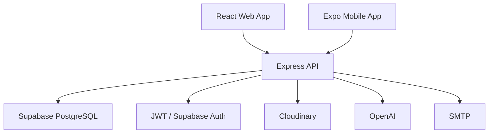

# AURUM
Nền tảng học tập Hóa học tương tác cho học sinh, giáo viên và quản trị viên.
_Cập nhật: 04/06/2026_

## 1. Tổng quan
AURUM là web app học Hóa học được xây bằng React, Vite, Express và Supabase PostgreSQL.
Hệ thống phục vụ ba nhóm người dùng chính: học sinh, giáo viên và quản trị viên.
Học sinh học theo hành trình, làm quiz, nhận XP, giữ streak và tham gia đấu trường.
Giáo viên quản lý lớp, bài đăng, bài tập, lịch học và học liệu.
Quản trị viên quản lý người dùng, bài học, phản hồi và dữ liệu hệ thống.
Database đã được chuẩn hóa sang tên bảng/cột tiếng Việt không dấu, snake_case.
API public vẫn giữ nhiều endpoint tiếng Anh quen thuộc để giảm rủi ro phá frontend web/mobile.

## 2. Mục tiêu sản phẩm
- Cung cấp lộ trình học Hóa học từ lớp 8 đến lớp 12.
- Tổ chức bài học thành nhiều stage: intro, story, challenge, quiz, reward.
- Theo dõi tiến độ học, XP, level, streak và nhiệm vụ.
- Cung cấp lab ảo, mô hình phân tử và cân bằng phương trình.
- Cho phép tạo lớp, tham gia lớp, giao bài và chấm bài.
- Cung cấp thư viện học liệu có upload, xem, phản hồi và trả lời.
- Tổ chức đấu trường trả lời câu hỏi theo vòng.
- Hỗ trợ phân tích tài liệu bằng AI.

## 3. Tech stack
| Layer | Công nghệ | Vai trò |
| --- | --- | --- |
| Frontend | React 19, Vite 8 | Web SPA |
| Routing | React Router 7 | Route public, student, teacher, admin |
| Styling | Tailwind CSS 4 | Giao diện responsive |
| Motion | Framer Motion | Animation, transition |
| 3D | Three.js, React Three Fiber | Lab 3D, mô hình phân tử |
| Charts | Recharts | Dashboard và thống kê |
| Backend | Express 4 | REST API |
| Serverless | serverless-http | Deploy API dạng function |
| Database | Supabase PostgreSQL | Dữ liệu nghiệp vụ |
| Auth | JWT, bcryptjs, Supabase Auth fallback | Đăng nhập và phân quyền |
| Upload | Cloudinary, multer | File, ảnh, video học liệu |
| Email | Nodemailer | Email hệ thống |
| AI | OpenAI, pdf-parse, mammoth | Phân tích tài liệu |
| Test | Vitest, Testing Library, Supertest | Unit và integration test |

## 4. Kiến trúc tổng thể

Frontend gọi backend qua `/api/*`.
Backend xác thực token bằng middleware trong `api/_middleware/auth.js`.
Backend dùng Supabase client trong `api/lib/supabase.js` để truy vấn database.
Các model trong `api/models/` gom logic truy vấn dùng lại nhiều nơi.
Một số response vẫn trả alias tiếng Anh như `title`, `score`, `class_id` để giữ contract.

## 5. Cấu trúc thư mục
```text
AURUM/
├── api/
│   ├── _middleware/       # Auth middleware và role guard
│   ├── _routes/           # REST routes theo module
│   ├── lib/               # Supabase client, mailer, helpers
│   ├── models/            # Model wrappers cho Supabase
│   ├── env.js             # Load biến môi trường
│   └── index.js           # Express entrypoint
├── apps/
│   └── mobile/            # Mobile app dùng Expo
├── docs/                  # Tài liệu thiết kế và ghi chú kỹ thuật
├── public/                # Static assets
├── scripts/               # Seed, migrate, backup, docs generator
├── src/
│   ├── components/        # UI components
│   ├── constants/         # Hằng số frontend
│   ├── context/           # AuthContext
│   ├── data/              # Curriculum, lab, chemistry dataset
│   ├── lib/               # Supabase browser client
│   ├── locales/           # i18n resources
│   ├── pages/             # Student, teacher, admin, auth pages
│   ├── services/          # Frontend services
│   └── utils/             # Helper utilities
├── supabase/
│   └── schema.sql         # Snapshot/schema SQL mới nhất
└── tests/                 # Vitest suites
```

## 6. Frontend routes
| Nhóm | Route | Mục đích |
| --- | --- | --- |
| Public | `/` | Trang chủ |
| Public | `/about` | Giới thiệu |
| Public | `/contact` | Liên hệ |
| Public | `/terms` | Điều khoản |
| Public | `/lectures` | Bài giảng |
| Auth | `/login` | Đăng nhập |
| Auth | `/register` | Đăng ký |
| Auth | `/auth/callback` | OAuth callback |
| Student | `/bai_hoc` | Danh sách bài học |
| Student | `/bai_hoc/:grade` | Bài học theo khối |
| Student | `/bai_hoc/:grade/:lessonId` | Chi tiết bài học |
| Student | `/classroom` | Chọn lớp/hành trình |
| Student | `/my-class` | Lớp đã tham gia |
| Student | `/classroom/:grade/journey` | Hành trình theo khối |
| Student | `/classroom/:grade/journey/:lessonId/intro` | Stage giới thiệu |
| Student | `/classroom/:grade/journey/:lessonId/story` | Stage câu chuyện |
| Student | `/classroom/:grade/journey/:lessonId/challenge` | Stage thử thách |
| Student | `/classroom/:grade/journey/:lessonId/quiz` | Stage quiz |
| Student | `/classroom/:grade/journey/:lessonId/reward` | Stage phần thưởng |
| Student | `/lab` | Lab hóa học |
| Student | `/lab/simulator` | Mô phỏng lab |
| Student | `/lab/balancer` | Cân bằng phương trình |
| Student | `/lab/molecules` | Mô hình phân tử |
| Student | `/lab/solver` | Công cụ giải bài |
| Student | `/lab/discovery` | Sổ khám phá |
| Student | `/arena` | Đấu trường |
| Student | `/library` | Thư viện học liệu |
| Student | `/library/:id` | Chi tiết học liệu |
| Student | `/profile` | Hồ sơ |
| Student | `/settings` | Cài đặt |
| Student | `/knowledge-map` | Bản đồ kiến thức |
| Student | `/calculator` | Máy tính hóa học |
| Admin | `/admin` | Dashboard admin |
| Admin | `/admin/journey` | Quản lý hành trình |
| Admin | `/admin/journey/:lessonId` | Chi tiết hành trình |
| Admin | `/admin/bai_hoc` | Quản lý bài học |
| Admin | `/admin/nguoi_dung` | Quản lý người dùng |
| Admin | `/admin/phan_hoi` | Quản lý phản hồi |
| Teacher | `/teacher` | Dashboard giáo viên |
| Teacher | `/teacher/lop` | Quản lý lớp |
| Teacher | `/teacher/lop/:id` | Chi tiết lớp |
| Teacher | `/teacher/assignments` | Quản lý bài tập |
| Teacher | `/teacher/library` | Quản lý học liệu |

## 7. Backend API
| Prefix | File | Vai trò |
| --- | --- | --- |
| `/api/auth` | `api/_routes/auth.js` | Đăng ký, đăng nhập, OAuth, teacher request |
| `/api/user` | `api/_routes/user.js` | Hồ sơ, tiến độ, streak, activity |
| `/api/admin` | `api/_routes/admin.js` | Dashboard, user, feedback, lesson |
| `/api/lessons` | `api/_routes/lessons.js` | Bài học |
| `/api/materials` | `api/_routes/materials.js` | Học liệu và phản hồi học liệu |
| `/api/classes` | `api/_routes/classes.js` | Lớp, thành viên, bài đăng, bài nộp |
| `/api/lab` | `api/_routes/lab.js` | Hóa chất, phản ứng, câu hỏi cân bằng |
| `/api/arena` | `api/_routes/arena.js` | Phòng đấu, người chơi, vòng đấu |
| `/api/missions` | `api/_routes/missions.js` | Nhiệm vụ và nhận thưởng |
| `/api/discussions` | `api/_routes/discussions.js` | Thảo luận bài học |
| `/api/elements` | `api/_routes/elements.js` | Dữ liệu bảng tuần hoàn |
| `/api/analyze` | `api/_routes/analyze_v3.js` | Phân tích tài liệu bằng AI |
| `/api/health` | `api/index.js` | Health check |
`/api/analyze` được lazy-load để tránh import sớm các package nặng.
Route admin, teacher và classroom kiểm tra role hoặc owner trước khi ghi dữ liệu.
Các hàm normalize trong backend giữ backward compatibility cho frontend.

## 8. Authentication
Đăng nhập username/password dùng custom JWT.
Password được hash bằng `bcryptjs`.
JWT chứa `id`, `role` và `sessionId`.
`current_session_id` trong `nguoi_dung` dùng để chặn đăng nhập song song.
Nếu session trong JWT khác session trong DB, backend trả lỗi `DUAL_LOGIN`.
Supabase Auth token được hỗ trợ như fallback cho OAuth.
Role chính gồm `student`, `teacher` và `admin`.

## 9. Quy tắc database
Schema nghiệp vụ chính nằm trong `public`.
Tên bảng nghiệp vụ dùng tiếng Việt không dấu, snake_case.
Tên kỹ thuật phổ biến được giữ nguyên: `id`, `created_at`, `updated_at`, `status`, `type`, `role`, `email`, `username`, `file_url`, `media_url`, `url`.
Bảng Supabase-managed trong `auth` và `storage` không đổi.
Không tạo bảng/cột mới với tên mơ hồ như `data`, `info`, `item`, `value`.
Không truy vấn trực tiếp bảng tiếng Anh cũ trong runtime code.

## 10. Mapping bảng chính
| Bảng cũ | Bảng mới | Ý nghĩa |
| --- | --- | --- |
| `users` | `nguoi_dung` | Tài khoản và hồ sơ |
| `grade_levels` | `khoi` | Khối lớp |
| `lessons` | `bai_hoc` | Bài học |
| `lesson_discussions` | `thao_luan` | Thảo luận bài học |
| `user_notes` | `ghi_chu` | Ghi chú cá nhân |
| `user_progress` | `tien_do_nguoi_dung` | Tiến độ học |
| `user_activities` | `hoat_dong_nguoi_dung` | Nhật ký hoạt động |
| `missions` | `nhiem_vu` | Nhiệm vụ |
| `user_missions` | `nhiem_vu_nguoi_dung` | Nhiệm vụ theo người dùng |
| `materials` | `hoc_lieu` | Thư viện học liệu |
| `material_feedback` | `phan_hoi_hoc_lieu` | Đánh giá học liệu |
| `feedback` | `phan_hoi` | Góp ý hệ thống |
| `classes` | `lop` | Lớp học |
| `class_members` | `thanh_vien_lop` | Thành viên lớp |
| `class_posts` | `bai_dang_lop` | Bài đăng lớp |
| `class_schedules` | `lich_lop` | Lịch lớp |
| `class_assignment_submissions` | `bai_nop` | Bài nộp |
| `lab_chemicals` | `hoa_chat` | Hóa chất |
| `lab_reactions` | `phan_ung` | Phản ứng |
| `balancing_questions` | `cau_hoi_can` | Câu hỏi cân bằng |
| `arena_questions` | `cau_hoi_dau` | Câu hỏi đấu trường |
| `arena_rooms` | `phong_dau` | Phòng đấu |
| `arena_room_players` | `nguoi_choi` | Người chơi trong phòng |
| `arena_round_answers` | `tra_loi_vong` | Trả lời theo vòng |
| `arena_match_history` | `lich_su_dau` | Lịch sử đấu |

## 11. Mapping cột phổ biến
| Cột cũ | Cột mới | Ghi chú |
| --- | --- | --- |
| `title` | `tieu_de` | Tiêu đề |
| `description` | `mo_ta` | Mô tả |
| `content` | `noi_dung` | Nội dung |
| `name` | `ten` | Tên |
| `grade_level_id` | `khoi_id` | Khối lớp |
| `lesson_id` | `bai_hoc_id` | Bài học |
| `class_id` | `lop_id` | Lớp học |
| `teacher_id` | `giao_vien_id` | Giáo viên |
| `student_id` | `hoc_sinh_id` | Học sinh |
| `user_id` | `nguoi_dung_id` | Người dùng |
| `mission_id` | `nhiem_vu_id` | Nhiệm vụ |
| `material_id` | `hoc_lieu_id` | Học liệu |
| `post_id` | `bai_dang_id` | Bài đăng |
| `question_text` | `noi_dung_cau_hoi` | Câu hỏi |
| `correct_answer` | `dap_an_dung` | Đáp án đúng |
| `reactants` | `chat_tham_gia` | Chất tham gia |
| `products` | `san_pham` | Sản phẩm |
| `equation` | `phuong_trinh` | Phương trình |
| `difficulty` | `do_kho` | Độ khó |
| `score` | `diem` | Điểm |
| `views` | `luot_xem` | Lượt xem |
| `likes_count` | `luot_thich` | Lượt thích |
| `is_practice` | `la_luyen_tap` | Phòng luyện tập |

## 12. Quan hệ dữ liệu chính
`nguoi_dung` liên kết với `tien_do_nguoi_dung`, `nhiem_vu_nguoi_dung`, `hoat_dong_nguoi_dung`, `ghi_chu` và `thao_luan`.
`khoi` liên kết với `bai_hoc`, `lop`, `phan_ung`, `cau_hoi_can` và `cau_hoi_dau`.
`bai_hoc` liên kết với `thao_luan`, `ghi_chu` và một phần dữ liệu `cau_hoi_can`.
`lop` liên kết với `thanh_vien_lop`, `bai_dang_lop` và `lich_lop`.
`bai_dang_lop` liên kết với `bai_nop`.
`phong_dau` liên kết với `nguoi_choi`, `tra_loi_vong` và `lich_su_dau`.
`hoc_lieu` liên kết với `phan_hoi_hoc_lieu`.

## 13. Các module chính
`bai_hoc` lưu bài học, nội dung stage, quiz, challenge, story và game.
`tien_do_nguoi_dung` lưu tiến độ học, mở khóa và payload học tập.
`nhiem_vu` và `nhiem_vu_nguoi_dung` phục vụ gamification, XP và nhận thưởng.
`lop`, `thanh_vien_lop`, `bai_dang_lop`, `bai_nop` và `lich_lop` phục vụ classroom.
`hoc_lieu` và `phan_hoi_hoc_lieu` phục vụ thư viện học liệu.
`hoa_chat`, `phan_ung` và `cau_hoi_can` phục vụ lab và cân bằng phương trình.
`phong_dau`, `nguoi_choi`, `cau_hoi_dau`, `tra_loi_vong` và `lich_su_dau` phục vụ arena.
Route `/api/analyze` hỗ trợ phân tích PDF/DOCX và gọi OpenAI.

## 14. Biến môi trường
Tạo `.env.local` cho môi trường local và không commit secret vào repository.
| Biến | Vai trò |
| --- | --- |
| `SUPABASE_URL` | URL Supabase server-side |
| `SUPABASE_KEY` | Key server-side |
| `SUPABASE_SERVICE_ROLE_KEY` | Service role key nếu tách riêng |
| `VITE_SUPABASE_URL` | URL Supabase cho frontend |
| `VITE_SUPABASE_ANON_KEY` | Anon key cho frontend |
| `JWT_SECRET` | Secret ký custom JWT |
| `SUPABASE_JWT_SECRET` | Secret tạo realtime token |
| `FRONTEND_URL` | URL frontend chính |
| `CORS_ORIGINS` | Danh sách origin được phép |
| `OPENAI_API_KEY` | OpenAI API key |
| `CLOUDINARY_CLOUD_NAME` | Cloudinary cloud name |
| `CLOUDINARY_API_KEY` | Cloudinary API key |
| `CLOUDINARY_API_SECRET` | Cloudinary API secret |
| `SMTP_HOST` | SMTP host |
| `SMTP_PORT` | SMTP port |
| `SMTP_USER` | SMTP user |
| `SMTP_PASS` | SMTP password |
| `CRON_SECRET` | Secret bảo vệ cron endpoints |

## 15. Cài đặt local
Yêu cầu Node.js 20.x.
```bash
npm install
npm run dev
npm run server
npm run build
npm run preview
```
`npm run dev` chạy frontend.
`npm run server` chạy backend local.
`npm run build` kiểm tra build production.
`npm run preview` xem thử bản build.

## 16. Database scripts
```bash
npm run db:backup
npm run db:migrate:restructure
npm run db:validate:restructure
npm run seed
npm run migrate-lab
npm run upload-curriculum
```
Chạy backup trước mọi migration lớn.
Chạy validate schema sau khi apply migration.
Không sửa database thủ công nếu thay đổi đó cần được deploy lại.

## 17. Schema SQL quan trọng
Schema chuẩn hóa hiện được gom trong `supabase/schema.sql`.
File này tạo schema nghiệp vụ tiếng Việt không dấu, RPC, index, RLS policy, realtime publication và seed hệ thống tối thiểu.
Khi cần cập nhật database, sửa `supabase/schema.sql` và chạy validate schema sau khi apply.

## 18. Kiểm thử
```bash
npm test
npm run lint
npm run lint -- --quiet
npm run build
```
Bộ test hiện có: `tests/arena.test.js`, `tests/arenaFrontend.test.jsx`, `tests/security.test.js`.
Lần xác minh gần nhất: test, build, lint quiet và validate restructure đều chạy thành công.
Runtime code không còn query `.from(...)` vào các bảng nghiệp vụ tiếng Anh cũ.

## 19. Quy ước code
Không đổi tên API public nếu không cần thiết.
Không truy vấn trực tiếp bảng tiếng Anh cũ.
Khi cần alias cho frontend, normalize ở backend.
Tên bảng/cột database nghiệp vụ dùng tiếng Việt không dấu.
Tên field kỹ thuật có thể giữ tiếng Anh.
Không sửa bảng Supabase-managed nếu không có lý do rõ ràng.

## 20. Quy ước commit
Commit message dùng tiếng Việt và Conventional Commits.
Các type hợp lệ: `feat`, `fix`, `refactor`, `style`, `docs`, `chore`, `test`.
Ví dụ: `docs: cập nhật readme theo schema mới`.

## 21. Checklist khi sửa database
1. Đọc schema live trước khi sửa.
2. Phân loại bảng nghiệp vụ và bảng kỹ thuật.
3. Lập mapping tên cũ sang tên mới.
4. Tạo backup trước migration.
5. Viết migration dạng rename an toàn.
6. Cập nhật foreign key, unique constraint và index.
7. Cập nhật RLS policy, trigger, function và RPC.
8. Cập nhật backend query và model.
9. Cập nhật frontend state, form, seed, script và test.
10. Chạy validate schema, test, lint, build và grep lại tên bảng cũ.

## 22. Ghi chú vận hành
Supabase Table Editor hiện nên hiển thị các bảng nghiệp vụ bằng tên tiếng Việt không dấu.
Nếu còn bảng như `classes`, `lessons`, `feedback`, `materials` trong `public`, cần kiểm tra lại migration.
Các script mới nên dùng bảng `nguoi_dung`, `bai_hoc`, `hoc_lieu`, `lop`, `phong_dau`.
RLS policy, function và RPC cần được kiểm tra sau mỗi lần đổi schema.
Không dùng `git reset --hard` để rollback dữ liệu hoặc code khi chưa có backup.

## 23. Tài liệu nhanh cho developer mới
Bắt đầu từ `src/App.jsx` để hiểu route tree.
Đọc `api/index.js` để hiểu API mount points.
Đọc `api/_middleware/auth.js` để hiểu xác thực.
Đọc `api/models/User.js`, `Lesson.js`, `Mission.js` để hiểu mapping database.
Đọc `api/_routes/classes.js` nếu làm phần classroom.
Đọc `api/_routes/arena.js` nếu làm phần đấu trường.
Đọc `api/_routes/materials.js` nếu làm phần thư viện.
Đọc `scripts/db/validateRestructure.js` khi kiểm tra schema.
Đọc `supabase/schema.sql` trước khi sửa database.

---
AURUM hiện dùng schema database đã chuẩn hóa theo nghiệp vụ, trong khi vẫn giữ API public đủ ổn định để giảm rủi ro khi triển khai.
