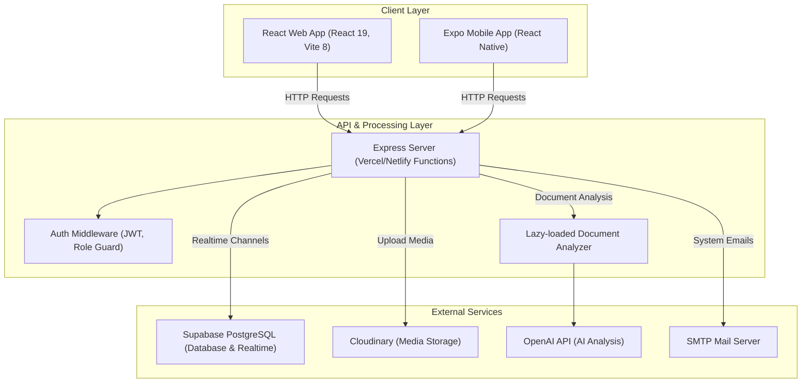

# AURUM - Nền Tảng Học Tập Hóa Học Tương Tác

AURUM là một hệ thống quản lý học tập (LMS) và mô phỏng thí nghiệm Hóa học trực quan dành cho học sinh trung học (từ lớp 8 đến lớp 12), giáo viên và quản trị viên. Nền tảng tích hợp công nghệ web 3D và trí tuệ nhân tạo (AI) để biến các kiến thức Hóa học trừu tượng thành những trải nghiệm tương tác trực quan sinh động.

---

## 1. Tổng Quan Hệ Thống

Hệ thống được thiết kế hướng tới ba nhóm đối tượng người dùng chính với các đặc quyền và giao diện chuyên biệt:

*   **Học sinh (Student):**
    *   Học tập theo lộ trình cá nhân hóa (Grade Journey) chia theo từng khối lớp từ lớp 8 đến lớp 12.
    *   Mỗi bài học được chia thành 5 giai đoạn (Stages): Giới thiệu (Intro), Câu chuyện hóa học (Story), Thử thách tương tác (Challenge), Bài kiểm tra nhanh (Quiz), và Phần thưởng tích lũy (Reward).
    *   Tham gia Đấu trường (Arena) real-time để thi đấu PK trực tiếp với người chơi khác hoặc luyện tập cá nhân.
    *   Học tập thông qua Lab mô phỏng 3D, cân bằng phương trình, và khám phá sổ tay khoa học.
    *   Động lực học tập được duy trì bằng các cơ chế trò chơi hóa (Gamification): XP, Level, Streak ngày học và hệ thống Nhiệm vụ (Missions).
*   **Giáo viên (Teacher):**
    *   Quản lý lớp học, đăng tin tức, phê duyệt học sinh xin tham gia lớp.
    *   Giao bài tập, theo dõi tiến độ nộp bài và chấm điểm trực tuyến.
    *   Quản lý lịch học của các lớp, chia sẻ học liệu lên thư viện dùng chung.
*   **Quản trị viên (Admin):**
    *   Giám sát hoạt động của toàn hệ thống thông qua dashboard thống kê tổng quan.
    *   Quản lý thông tin người dùng, phê duyệt yêu cầu đăng ký tài khoản giáo viên.
    *   Thiết lập lộ trình học tập, quản lý bài học, các chặng hành trình và xử lý phản hồi từ người dùng.

---

## 2. Kiến Trúc & Sơ Đồ Luồng Dữ Liệu

Hệ thống AURUM tuân thủ kiến trúc phân tầng hiện đại, tách biệt giữa ứng dụng Client (React SPA & Expo Mobile) và ứng dụng Server (Express API), giao tiếp với nhau qua giao thức RESTful API bảo mật.

*   **Luồng Xác thực:** Client gửi request kèm token JWT trong header. Middleware `auth.js` giải mã token, kiểm tra vai trò người dùng (Role Guard) và kiểm tra Session ID trong cơ sở dữ liệu để ngăn chặn đăng nhập đồng thời trên nhiều thiết bị (Dual-login prevention).
*   **Luồng Dữ liệu Realtime:** Sử dụng Supabase Realtime Channels để đồng bộ trạng thái phòng đấu trường (Arena) giữa các đối thủ mà không cần client phải reload hoặc gửi request liên tục.
*   **Luồng Xử lý Tài liệu AI:** Các thư viện nặng như `pdf-parse`, `word-extractor` và `multer` được lazy-load động tại endpoint `/api/analyze` để tránh làm chậm thời gian khởi động (cold start) của Serverless Functions.

---

## 3. Công Nghệ Sử Dụng (Tech Stack)

| Phân tầng | Công nghệ / Thư viện | Vai trò & Ứng dụng |
| :--- | :--- | :--- |
| **Frontend** | React 19, Vite 8 | Xây dựng Single Page Application (SPA) tốc độ cao |
| **Routing** | React Router 7 | Điều hướng phân quyền (Student, Teacher, Admin, Public) |
| **Styling** | Tailwind CSS 4, Framer Motion | Thiết kế giao diện responsive và các hiệu ứng chuyển động mượt mà |
| **3D & Đồ họa** | Three.js, React Three Fiber | Render mô hình phân tử 3D tương tác và phòng Lab mô phỏng |
| **Thống kê** | Recharts | Trực quan hóa dữ liệu học tập trên các Dashboard quản lý |
| **Backend** | Express 4, serverless-http | Định tuyến API và đóng gói chạy trên nền tảng Serverless |
| **Database** | Supabase PostgreSQL | Lưu trữ dữ liệu nghiệp vụ có cấu trúc |
| **Security** | JWT, bcryptjs | Mã hóa mật khẩu và tạo token xác thực phiên làm việc |
| **AI Integration** | OpenAI API, pdf-parse, mammoth | Trích xuất văn bản tài liệu và phân tích học liệu bằng AI |
| **Storage** | Cloudinary, multer | Upload và lưu trữ file tài liệu, hình ảnh, video học liệu |
| **Email Service** | Nodemailer | Gửi thư thông báo kích hoạt, nhắc nhở học tập |

---

## 4. Các Phân Hệ Tính Năng Nghiệp Vụ

### 4.1. Phân hệ Hành Trình Học Tập (Learning Journey)
Phân hệ này xây dựng lộ trình học Hóa học trực quan. Mỗi khối lớp (Grade) có một hành trình riêng. Khi click vào một bài học, học sinh trải qua các chặng:
1.  **Intro (Giới thiệu):** Tóm tắt mục tiêu bài học và kiến thức trọng tâm.
2.  **Story (Câu chuyện):** Dẫn dắt kiến thức hóa học qua các câu chuyện thực tế gần gũi.
3.  **Challenge (Thử thách):** Học sinh thực hiện các tương tác trực tiếp với mô hình hoặc kéo thả để giải quyết tình huống hóa học.
4.  **Quiz (Trắc nghiệm):** Kiểm tra nhanh mức độ hiểu bài của học sinh để ghi nhận XP.
5.  **Reward (Phần thưởng):** Mở khóa bài học tiếp theo, cộng điểm XP và cập nhật chuỗi streak học tập.

### 4.2. Phân hệ Lab Ảo 3D & Tiện Ích Hóa Học
Học sinh có thể thực hành thí nghiệm an toàn ngay trên trình duyệt:
*   **Mô phỏng thí nghiệm (Lab Simulator):** Cho phép tương tác với các dụng cụ (ống nghiệm, đèn cồn, pipet) và hóa chất phổ biến để quan sát hiện tượng đổi màu, kết tủa, thoát khí.
*   **Mô hình phân tử (Molecule Viewer):** Render 3D các liên kết hóa học của phân tử (như $H_2O$, $CO_2$, $CH_4$) bằng Three.js, hỗ trợ xoay, phóng to để quan sát cấu trúc không gian.
*   **Cân bằng phương trình (Equation Balancer):** Công cụ thông minh giúp tự động hoặc hướng dẫn học sinh cân bằng các phản ứng hóa học từ đơn giản đến phức tạp.
*   **Máy tính hóa học & Sổ tay khám phá:** Hỗ trợ tính toán nhanh khối lượng, số mol, nồng độ dung dịch và ghi chép lại các chất hóa học đã mở khóa.

### 4.3. Phân hệ Đấu Trường Tương Tác (Arena PK)
Đấu trường là phân hệ real-time cạnh tranh cao:
*   Vòng đời trận đấu được quản lý bằng State Machine: `lobby` -> `matchmaking` -> `preparing` -> `countdown` -> `playing` -> `resolving` -> `finished`.
*   Trận đấu là chuỗi mini game hóa học đa dạng như: Cân bằng phương trình nhanh, Ghép electron vào orbital, Ghép nguyên tử tạo phân tử, Tính toán hóa học có giới hạn thời gian.
*   Hệ thống tính điểm dựa trên độ chính xác, độ khó, thời gian hoàn thành (speed bonus) và chuỗi đúng liên tiếp (combo streak).
*   Chống gian lận (Anti-cheat): Frontend không nhận đáp án (`answer`) mà chỉ nhận payload mô phỏng. Toàn bộ logic kiểm tra đáp án và chấm điểm được thực hiện hoàn toàn ở Backend.

### 4.4. Phân hệ Quản Lý Lớp Học & Học Liệu
Phục vụ nhu cầu tương tác giữa Giáo viên và Học sinh:
*   Giáo viên tạo lớp học và cung cấp mã tham gia. Học sinh nhập mã để vào lớp.
*   Lớp học hỗ trợ bảng tin để trao đổi, đính kèm tài liệu học tập.
*   Giáo viên giao bài tập (Assignment) kèm hạn nộp. Học sinh làm bài trực tiếp và nộp file hoặc văn bản. Giáo viên xem danh sách bài nộp và chấm điểm.
*   Thư viện học liệu cho phép tải lên các tài liệu định dạng PDF, Word. Hệ thống tích hợp OpenAI để tự động đọc, tóm tắt và phân tích tài liệu giúp học sinh nắm bắt nội dung nhanh chóng.

---

## 5. Cơ Sở Dữ Liệu & Quy Tắc Chuẩn Hóa

Hệ thống sử dụng cơ sở dữ liệu Supabase PostgreSQL. Để tăng tính nhất quán và dễ đọc, toàn bộ cơ sở dữ liệu đã được chuẩn hóa theo các quy tắc sau:
1.  **Tên bảng nghiệp vụ:** Được dịch sang tiếng Việt không dấu, viết dưới dạng `snake_case` (ví dụ: `nguoi_dung`, `bai_hoc`, `hoc_lieu`).
2.  **Tên cột nghiệp vụ:** Tương tự tên bảng, sử dụng tiếng Việt không dấu, snake_case (ví dụ: `tieu_de`, `mo_ta`, `chat_tham_gia`).
3.  **Tên kỹ thuật phổ biến:** Giữ nguyên tiếng Anh cho các trường kỹ thuật hệ thống như `id`, `created_at`, `updated_at`, `status`, `type`, `role`, `email`, `username`, `file_url`, `media_url`.
4.  **Tương thích ngược:** Để giảm thiểu rủi ro lỗi trên frontend và các client mobile hiện tại, lớp API của Backend thực hiện việc chuẩn hóa (normalize) và trả về các alias tiếng Anh phổ biến như `title`, `score`, `class_id` trong HTTP response.

### 5.1. Bảng Đối Chiếu Thực Thể (Database Table Mapping)

| Tên bảng cũ (Tiếng Anh) | Tên bảng mới (Tiếng Việt) | Vai trò trong hệ thống |
| :--- | :--- | :--- |
| `users` | `nguoi_dung` | Lưu trữ thông tin tài khoản, mật khẩu băm, vai trò và thông tin cá nhân |
| `grade_levels` | `khoi` | Danh mục các khối lớp (Lớp 8 đến Lớp 12) |
| `lessons` | `bai_hoc` | Các bài học Hóa học chính khóa |
| `lesson_discussions` | `thao_luan` | Bình luận và thảo luận dưới mỗi bài học |
| `user_notes` | `ghi_chu` | Ghi chú cá nhân của học sinh trong quá trình học |
| `user_progress` | `tien_do_nguoi_dung` | Lưu vết bài học đã qua, các stage đã hoàn thành của học sinh |
| `user_activities` | `hoat_dong_nguoi_dung` | Nhật ký hoạt động của tài khoản phục vụ bảo mật và thống kê |
| `missions` | `nhiem_vu` | Danh sách các nhiệm vụ ngày/tuần được cấu hình sẵn |
| `user_missions` | `nhiem_vu_nguoi_dung` | Tiến độ thực hiện nhiệm vụ của từng học sinh |
| `materials` | `hoc_lieu` | Kho tài liệu tham khảo trong thư viện |
| `material_feedback` | `phan_hoi_hoc_lieu` | Đánh giá và nhận xét của học sinh về tài liệu |
| `feedback` | `phan_hoi` | Các đóng góp ý kiến của người dùng gửi tới quản trị viên |
| `classes` | `lop` | Thông tin lớp học do giáo viên làm chủ |
| `class_members` | `thanh_vien_lop` | Danh sách học sinh tham gia các lớp học |
| `class_posts` | `bai_dang_lop` | Các bài viết trao đổi trên bảng tin lớp học |
| `class_schedules` | `lich_lop` | Lịch học, lịch kiểm tra của lớp học |
| `class_assignment_submissions` | `bai_nop` | Danh sách bài nộp và điểm số của học sinh cho bài tập |
| `lab_chemicals` | `hoa_chat` | Danh mục hóa chất trong phòng thí nghiệm ảo |
| `lab_reactions` | `phan_ung` | Danh mục các phản ứng hóa học hỗ trợ mô phỏng |
| `balancing_questions` | `cau_hoi_can` | Bộ câu hỏi phục vụ minigame cân bằng phương trình |
| `arena_questions` | `cau_hoi_dau` | Ngân hàng câu hỏi/mini game của đấu trường PK |
| `arena_rooms` | `phong_dau` | Phiên phòng đấu đang diễn ra hoặc đã kết thúc |
| `arena_room_players` | `nguoi_choi` | Trạng thái người chơi tham gia trong phòng đấu |
| `arena_round_answers` | `tra_loi_vong` | Ghi nhận đáp án người chơi submit theo từng lượt đấu |
| `arena_match_history` | `lich_su_dau` | Lưu kết quả thắng/thua, điểm số sau khi trận đấu kết thúc |

---

## 6. Sơ Đồ Định Tuyến (Routing)

### 6.1. Frontend Routes
Hệ thống React SPA quản lý định tuyến bằng React Router 7, phân cấp theo vai trò:

*   **Public Routes (Không yêu cầu đăng nhập):**
    *   `/` : Trang chủ giới thiệu nền tảng.
    *   `/about`, `/contact`, `/terms` : Các trang thông tin giới thiệu, liên hệ và điều khoản.
    *   `/lectures` : Thư viện bài giảng công khai.
*   **Auth Routes (Quản lý phiên đăng nhập):**
    *   `/login`, `/register` : Giao diện đăng nhập và đăng ký tài khoản.
    *   `/auth/callback` : Xử lý xác thực sau khi đăng nhập qua các nhà cung cấp OAuth.
*   **Student Routes (Yêu cầu vai trò `student`):**
    *   `/classroom` : Không gian lớp học và hành trình cá nhân.
    *   `/my-class` : Lớp học hiện tại học sinh đang tham gia.
    *   `/classroom/:grade/journey` : Lộ trình bài học theo khối lớp cụ thể.
    *   `/classroom/:grade/journey/:lessonId/[intro/story/challenge/quiz/reward]` : Các stage học tập tương tác.
    *   `/lab`, `/lab/simulator`, `/lab/molecules`, `/lab/balancer`, `/lab/solver`, `/lab/discovery` : Các công cụ thực hành thí nghiệm hóa học.
    *   `/arena` : Sảnh đấu trường PK real-time.
    *   `/library`, `/library/:id` : Tra cứu và xem chi tiết học liệu hỗ trợ AI.
    *   `/profile`, `/settings` : Hồ sơ học tập cá nhân và cài đặt tài khoản.
*   **Teacher Routes (Yêu cầu vai trò `teacher`):**
    *   `/teacher` : Dashboard giáo viên theo dõi tổng quan các lớp.
    *   `/teacher/lop`, `/teacher/lop/:id` : Quản lý danh sách lớp, học sinh và bài tập của lớp.
    *   `/teacher/assignments` : Quản lý bài tập giao cho học sinh.
    *   `/teacher/library` : Kho tài liệu riêng của giáo viên.
*   **Admin Routes (Yêu cầu vai trò `admin`):**
    *   `/admin` : Dashboard quản trị viên giám sát hệ thống.
    *   `/admin/journey`, `/admin/journey/:lessonId` : Quản lý lộ trình học tập và cấu hình stage.
    *   `/admin/nguoi_dung`, `/admin/nguoi_dung/:id` : Quản lý phân quyền và thông tin người dùng.
    *   `/admin/bai_hoc` : Quản lý nội dung bài học và video.
    *   `/admin/feedback` : Quản lý các khiếu nại, phản hồi và yêu cầu giáo viên.
    *   `/admin/approvals` : Duyệt thay đổi cần hai quản trị viên xác nhận.

### 6.2. Backend API Endpoint Prefix
Backend Express tổ chức các route nghiệp vụ thành các module riêng biệt dưới tiền tố `/api`:

*   `/api/auth` : Đăng ký, đăng nhập, kiểm tra yêu cầu làm giáo viên.
*   `/api/user` : Lấy thông tin cá nhân, cập nhật tiến độ, tính streak học tập.
*   `/api/lessons` : Lấy danh sách bài học, chi tiết nội dung các stage.
*   `/api/classes` : Tạo lớp, thêm học sinh, đăng bài thảo luận, chấm điểm bài nộp.
*   `/api/materials` : Upload học liệu, đánh giá tài liệu và quản lý phản hồi.
*   `/api/analyze` : Phân tích tài liệu PDF/Word bằng OpenAI API (Lazy-loaded).
*   `/api/lab` : Lấy danh sách hóa chất, phản ứng và câu hỏi cân bằng phương trình.
*   `/api/arena` : Tạo phòng đấu, matchmaking, đồng bộ realtime phòng đấu.
*   `/api/missions` : Lấy danh sách nhiệm vụ và nhận thưởng XP/Items.
*   `/api/discussions` : Quản lý thảo luận, hỏi đáp dưới các bài học.
*   `/api/elements` : Cung cấp dữ liệu chi tiết của bảng tuần hoàn hóa học.

---

## 7. Cơ Chế Xác Thực & An Toàn Hệ Thống

*   **Quản lý phiên bằng JWT:** Hệ thống sử dụng token JWT để duy trì đăng nhập. Token được mã hóa bằng thuật toán đối xứng cùng khóa bí mật `JWT_SECRET`. Phiên làm việc chứa thông tin cơ bản: ID người dùng, vai trò (`role`) và mã phiên duy nhất (`sessionId`).
*   **Ngăn chặn đăng nhập song song (Dual-Login Prevention):**
    1.  Mỗi lần đăng nhập thành công, server sinh một `sessionId` ngẫu nhiên và cập nhật vào trường `current_session_id` của bản ghi người dùng trong bảng `nguoi_dung`.
    2.  `sessionId` này đồng thời được ghi vào payload của mã token JWT trả về cho client.
    3.  Tại mỗi request gửi lên, middleware xác thực sẽ so sánh `sessionId` trong token với `current_session_id` hiện tại trong database.
    4.  Nếu hai giá trị khác nhau (do tài khoản vừa đăng nhập ở thiết bị khác), request lập tức bị từ chối với mã lỗi `DUAL_LOGIN` yêu cầu đăng nhập lại.
*   **Chính sách Bảo mật Database (RLS):** Kích hoạt Row Level Security (RLS) trên các bảng trong Supabase để đảm bảo học sinh không thể sửa đổi tiến độ của học sinh khác, giáo viên chỉ có quyền sửa đổi lớp học do mình làm chủ, và các bảng cấu hình chỉ có quản trị viên mới được phép ghi.

---

## 8. Quy Ước Phát Triển (Code & Commit Conventions)

### Cấu hình và kiểm tra phân hệ quản trị

- Báo cáo sửa lỗi, kiểm chứng và giới hạn: [Rà soát admin ngày 05/09/2026](docs/admin-audit-2026-09-05.md).
- Database đã được đồng bộ ngày 06/09/2026: [Các migration, kiểm chứng và giới hạn còn lại](docs/database-sync-2026-09-06.md).
- Đăng nhập và khôi phục mật khẩu: [Bản sửa bảo mật ngày 07/09/2026](docs/auth-security-audit-2026-09-07.md), gồm cấu hình SMTP, API mới, migration đã triển khai và các kiểm chứng.
- Upload học liệu trong admin dùng chữ ký từ `/api/admin/media/signature`. Máy chủ cần `CLOUDINARY_CLOUD_NAME`, `CLOUDINARY_API_KEY` và `CLOUDINARY_API_SECRET`. Không đặt khóa bí mật trong biến có tiền tố `VITE_`.
- Đặt `PUBLIC_APP_URL` thành địa chỉ website chính thức để liên kết đăng nhập trong email trỏ đúng môi trường. Nếu chưa đặt, hệ thống dùng `APP_URL`, sau đó `VERCEL_URL`, cuối cùng là domain production mặc định.
- Cập nhật chỉ mục bằng tệp `supabase/migrations/20260905162139_admin_query_indexes.sql` trong quy trình triển khai database. Tệp chỉ thêm chỉ mục; không cần chạy lại toàn bộ schema hoặc seed dữ liệu.
- API danh sách người dùng, phản hồi và yêu cầu duyệt hỗ trợ `limit` và con trỏ `before`. Header `X-Next-Cursor` cho biết trang kế tiếp; giao diện hiển thị nút tải thêm khi còn dữ liệu.
- Thay đổi quản trị cần hai tài khoản admin khác nhau xác nhận. Trang duyệt cho phép xem đầy đủ nội dung thay đổi. Bản ghi chưa có thời gian hoàn tất được hiển thị là “Chưa chốt kết quả” để kiểm tra lại dữ liệu trước khi gửi yêu cầu mới.
- Chạy `npm test`, `npm run lint` và `npm run build` trước khi triển khai. Kiểm thử tự động dùng dữ liệu giả lập cho các thao tác ghi; kiểm tra Supabase đang chạy chỉ dùng truy vấn đọc.

### 8.1. Quy ước viết mã nguồn
*   **Database:** Đảm bảo tuân thủ nghiêm ngặt việc đặt tên bảng/cột bằng tiếng Việt không dấu dưới dạng `snake_case`. Không tạo bảng mới có tên tiếng Anh hoặc tên mơ hồ như `info`, `data`.
*   **API Interface:** Giữ vững contract API hiện tại. Khi phát triển các endpoint mới, nếu cần chuyển đổi dữ liệu tiếng Việt từ database sang các trường tiếng Anh cho frontend, hãy thực hiện việc mapping (normalize) ngay tại controller của Backend, không sửa trực tiếp schema PostgreSQL.

### 8.2. Quy ước thông điệp Commit (Commit Messages)
Để đảm bảo lịch sử git rõ ràng, toàn bộ lập trình viên phải tuân thủ việc viết commit message bằng **Tiếng Việt** kết hợp chuẩn **Conventional Commits**:

Format chuẩn: `<type>: <mô tả ngắn gọn nội dung bằng tiếng Việt>`

Các `type` được chấp nhận sử dụng:
*   `feat` : Phát triển thêm chức năng mới (Ví dụ: `feat: thêm chức năng tạo câu hỏi bằng AI`).
*   `fix` : Sửa lỗi trong mã nguồn hoặc database (Ví dụ: `fix: sửa lỗi lưu trạng thái bài học`).
*   `refactor` : Tối ưu hóa hoặc tái cấu trúc mã nguồn nhưng không thay đổi hành vi (Ví dụ: `refactor: tách logic xử lý quiz trong trang admin`).
*   `style` : Thay đổi giao diện, định dạng code mà không ảnh hưởng logic (Ví dụ: `style: chỉnh màu giao diện phù hợp chế độ sáng tối`).
*   `docs` : Cập nhật tài liệu dự án như README hoặc tài liệu thiết kế (Ví dụ: `docs: cập nhật hướng dẫn sử dụng hệ thống`).
*   `test` : Thêm mới hoặc chỉnh sửa các bộ kiểm thử tự động (Ví dụ: `test: bổ sung unit test cho đấu trường`).
*   `chore` : Các thay đổi phụ trợ như cấu hình build, dọn dẹp file rác (Ví dụ: `chore: cập nhật dependencies trong package.json`).
