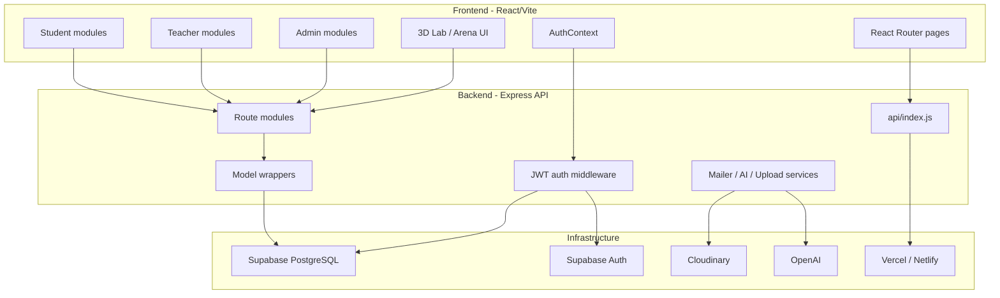
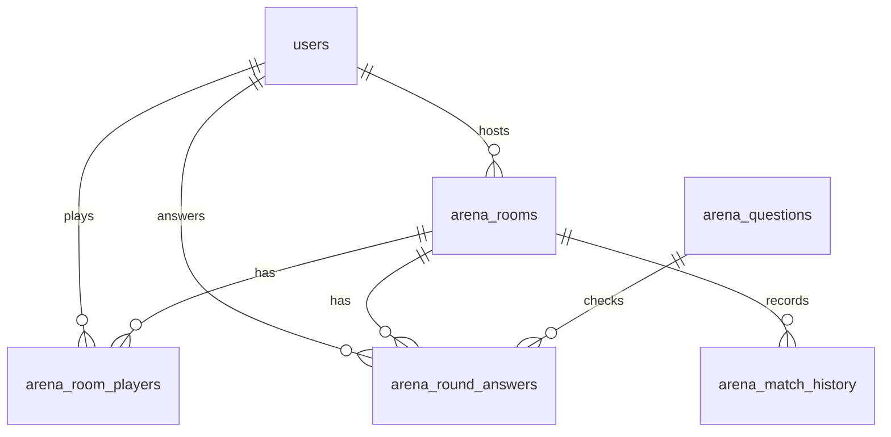
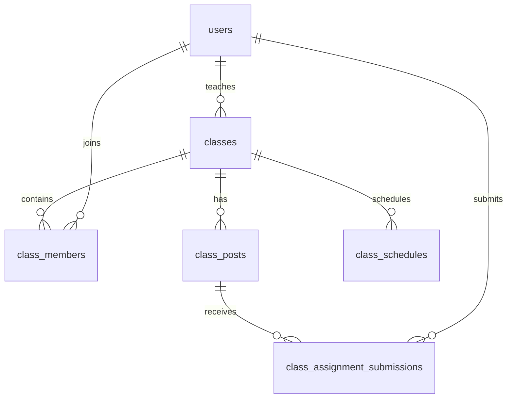
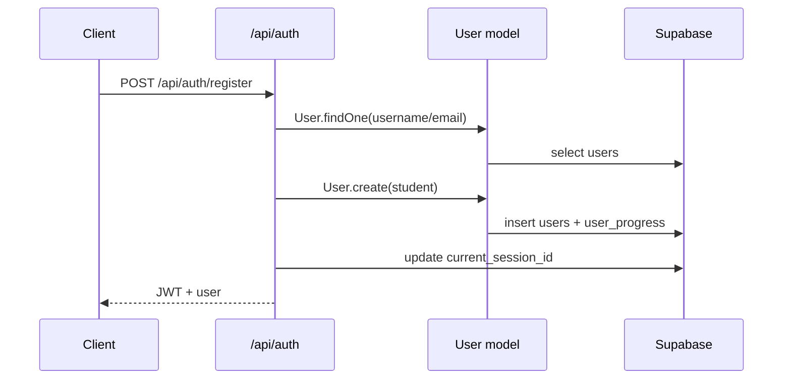

# AURUM - Phân tích hệ thống và Database

_Cập nhật: 02/06/2026_

## 1. Tổng quan dự án

**AURUM** là nền tảng học tập Hóa học tương tác dành cho học sinh, giáo viên và quản trị viên. Hệ thống hiện tại là một web app React SPA kết hợp backend Express chạy theo mô hình server/serverless, sử dụng Supabase PostgreSQL làm database trung tâm.

Mục tiêu chính của hệ thống:

- Cung cấp lộ trình học Hóa học từ lớp 8 đến lớp 12.
- Hỗ trợ học lý thuyết, video, quiz, thử thách và tiến trình gamification.
- Cung cấp phòng lab ảo, công cụ cân bằng phương trình, phân tử 3D và bảng tuần hoàn.
- Tổ chức lớp học cho giáo viên và học sinh: lớp, bài tập, lịch học, bài nộp, thảo luận.
- Quản trị người dùng, bài học, phản hồi, yêu cầu đăng ký giáo viên.
- Phân tích tài liệu bằng AI để hỗ trợ tạo nội dung/câu hỏi.

## 2. Tech stack

| Layer | Công nghệ | Vai trò |
| --- | --- | --- |
| Frontend | React 19, Vite 8, React Router 7 | SPA web client |
| Styling | Tailwind CSS 4, CSS custom design system | Giao diện AURUM, card, layout, responsive |
| Animation | Framer Motion | Animation, transition, gamification UI |
| 3D/Visual | Three.js, React Three Fiber | Lab 3D, mô hình phân tử, hiệu ứng thí nghiệm |
| State/Auth | React Context, localStorage, JWT | AuthContext và trạng thái người dùng |
| i18n | i18next, react-i18next | Song ngữ VI/EN |
| Backend | Express 4, serverless-http | REST API |
| Database | Supabase PostgreSQL | Dữ liệu người dùng, bài học, lab, arena, classroom |
| Auth | Custom JWT + Supabase OAuth fallback | Đăng nhập username/password, Google OAuth callback |
| File/Media | Cloudinary, multer | Upload ảnh/tài liệu/video |
| Email | Nodemailer | Duyệt giáo viên, reminder học tập/streak |
| AI | OpenAI, pdf-parse, mammoth, word-extractor | Phân tích PDF/DOCX, sinh câu hỏi |
| Tests | Vitest, Testing Library, Supertest | Unit/integration tests |

## 3. Kiến trúc tổng thể



## 4. Cấu trúc thư mục chính

```text
AURUM/
├── api/
│   ├── _middleware/        # JWT auth, role guard
│   ├── _routes/            # auth, user, arena, classes, lessons, lab...
│   ├── lib/                # Supabase client, mailer
│   ├── models/             # User, Lesson, Mission, Feedback, Discussion
│   ├── env.js              # Load env runtime
│   └── index.js            # Express entrypoint
├── src/
│   ├── components/         # UI, auth, navigation, lab, arena, lessons
│   ├── context/            # AuthContext
│   ├── data/               # curriculum, elements, molecules, reactions
│   ├── lib/                # Supabase browser client
│   ├── locales/            # vi.json, en.json
│   ├── pages/              # student, teacher, admin, auth pages
│   ├── services/           # activity logging service
│   ├── styles/             # global app CSS
│   ├── App.jsx             # Route tree
│   └── main.jsx            # React entrypoint
├── public/                 # static assets, images, icons, curriculum media
├── supabase/               # migration/schema SQL files
├── scripts/                # seed, migrate, backup, docs, upload tools
├── tests/                  # Vitest test suites
├── package.json
├── vite.config.js
└── README1.md
```

Ghi chú trạng thái hiện tại: trong workspace đang đọc, không có thư mục `apps/mobile` hoặc `packages/shared`; hệ thống hiện tại là web/API app chính.

## 5. Luồng frontend

File route chính: `src/App.jsx`.

### Nhóm trang public

| Route | Trang | Mục đích |
| --- | --- | --- |
| `/` | Home | Landing/dashboard học tập |
| `/about` | About | Giới thiệu |
| `/contact` | Contact | Liên hệ |
| `/terms` | Terms | Điều khoản |
| `/lectures` | Lectures | Bài giảng |
| `/lessons`, `/lessons/:grade`, `/lessons/:grade/:lessonId` | Lessons/LessonPage | Danh sách và chi tiết bài học |
| `/login`, `/register`, `/auth/callback` | Auth pages | Đăng nhập, đăng ký, OAuth callback |

### Nhóm trang Student cần đăng nhập

| Route | Module |
| --- | --- |
| `/periodic-table` | Bảng tuần hoàn |
| `/classroom` | Chọn lớp/lộ trình |
| `/my-class` | Lớp học đã tham gia |
| `/classroom/:grade/journey` | Journey theo lớp |
| `/classroom/:grade/journey/:lessonId/intro` | Stage Intro |
| `/classroom/:grade/journey/:lessonId/story` | Stage Story |
| `/classroom/:grade/journey/:lessonId/challenge` | Stage Challenge |
| `/classroom/:grade/journey/:lessonId/quiz` | Stage Quiz |
| `/classroom/:grade/journey/:lessonId/reward` | Stage Reward |
| `/lab`, `/lab/simulator`, `/lab/balancer`, `/lab/molecules`, `/lab/solver`, `/lab/discovery` | Lab tools |
| `/arena` | Đấu trường |
| `/library`, `/library/:id` | Thư viện tài liệu |
| `/profile`, `/settings` | Hồ sơ và cài đặt |
| `/knowledge-map`, `/calculator` | Bản đồ kiến thức, máy tính hóa học |

### Nhóm trang Teacher

| Route | Module |
| --- | --- |
| `/teacher` | Teacher dashboard |
| `/teacher/classes` | Quản lý lớp |
| `/teacher/classes/:id` | Chi tiết lớp |
| `/teacher/assignments` | Quản lý bài tập |

### Nhóm trang Admin

| Route | Module |
| --- | --- |
| `/admin` | Admin dashboard |
| `/admin/journey` | Quản lý journey |
| `/admin/journey/:lessonId` | Chi tiết journey |
| `/admin/lessons` | Quản lý bài học |
| `/admin/users` | Quản lý người dùng |
| `/admin/users/:id` | Chi tiết người dùng |
| `/admin/feedback` | Quản lý phản hồi/yêu cầu giáo viên |

## 6. Backend API

Entry point: `api/index.js`.

Backend mount các route dưới prefix `/api`:

| Prefix | File | Trách nhiệm |
| --- | --- | --- |
| `/api/auth` | `api/_routes/auth.js` | Register, login, magic login, teacher registration request |
| `/api/user` | `api/_routes/user.js` | Profile, heartbeat, progress, streak, activities, leaderboard, reminders |
| `/api/arena` | `api/_routes/arena.js` | Arena rooms, matchmaking, realtime token, answers, leaderboard |
| `/api/admin` | `api/_routes/admin.js` | Stats, users, feedback, lessons, teacher approval/rejection |
| `/api/lessons` | `api/_routes/lessons.js` | List lessons, lesson detail |
| `/api/materials` | `api/_routes/materials.js` | Library materials, view count, feedback/reply |
| `/api/elements` | `api/_routes/elements.js` | Periodic table data |
| `/api/lab` | `api/_routes/lab.js` | Chemicals, reactions, balancing questions/progress, unlock chemicals |
| `/api/missions` | `api/_routes/missions.js` | Mission list and claim reward |
| `/api/classes` | `api/_routes/classes.js` | Classes, members, posts, schedules, assignments, exam parser |
| `/api/discussions` | `api/_routes/discussions.js` | Lesson discussions/comments |
| `/api/analyze` | `api/_routes/analyze_v3.js` | AI document analysis, lazy-loaded |
| `/api/health` | `api/index.js` | Health check |

### Auth middleware

File: `api/_middleware/auth.js`.

Hệ thống hỗ trợ hai dạng token:

- **Custom JWT**: backend tự phát token khi login/register. Payload có `id`, `role`, `sessionId`.
- **Supabase Auth token**: fallback cho OAuth. Nếu user chưa tồn tại, backend có thể tạo student account từ metadata/email.

Các điểm bảo mật chính:

- Token đọc từ header `Authorization: Bearer <token>`.
- Custom JWT bắt buộc có `sessionId`.
- `current_session_id` trong bảng `users` dùng để chống đăng nhập đồng thời ở nhiều nơi.
- User bị khóa (`is_locked`) sẽ bị từ chối truy cập.
- `requireRole(...roles)` dùng cho admin/teacher guard.

## 7. Tính năng theo module

### 7.1. User, Auth, Profile

- Đăng ký public chỉ cho role `student`.
- Login bằng username hoặc email.
- Teacher registration không tạo user ngay; ghi yêu cầu vào `feedback` với type `teacher_registration`.
- Admin duyệt teacher request, tạo tài khoản teacher và gửi email magic login.
- Profile API gom dữ liệu từ `users` và `user_progress`.
- Heartbeat mỗi phút cập nhật `last_active_at`, `active_minutes`, `today_online_minutes`.
- Streak tăng khi hoàn thành bài hoặc online đủ 10 phút/ngày.

### 7.2. Lessons và Journey

- Bài học lưu trong bảng `lessons`.
- Backend map snake_case database sang camelCase frontend:
  - `class_id` -> `classId`
  - `program_id` -> `programId`
  - `theory_modules` -> `theoryModules`
  - `video_modules` -> `videoModules`
  - `story_slides` -> `storySlides`
  - `intro_video_url` -> `introVideoUrl`
  - `is_premium` -> `isPremium`
- Nội dung bài học dùng nhiều JSONB field: theory, video, quiz, story, challenge, game.
- Journey student gồm Intro, Story, Challenge, Quiz, Reward.
- Tiến độ lesson/chemical/balancing được chuẩn hóa vào `user_progress`.

### 7.3. Gamification

- XP và level nằm trong `users`.
- Công thức level hiện dùng phổ biến trong backend: `level = floor(xp / 1000) + 1`.
- `missions` định nghĩa nhiệm vụ; `user_missions` lưu tiến độ từng user.
- Mission claim dùng RPC `claim_mission_reward`.
- Daily missions được reset theo ngày trong model `Mission`.
- Streak lấy từ `streak_count`, `last_streak_at`, `today_online_minutes`, `today_lesson_completed`.

### 7.4. Lab

- `lab_chemicals`: danh mục hóa chất.
- `lab_reactions`: phản ứng hóa học, hiện tượng, độ nguy hiểm, điều kiện.
- `balancing_questions`: hơn 10.000 phương trình/câu hỏi cân bằng.
- API `/api/lab/balancing/search?q=` tìm phương trình đã cân bằng.
- Lab frontend gồm simulator, balancer, molecule viewer, solver và 3D Magic Lab.

### 7.5. Arena

Arena đã chuyển sang mô hình realtime/minigame:

- `arena_rooms`: phòng đấu.
- `arena_room_players`: người chơi trong phòng, điểm, trạng thái.
- `arena_questions`: câu hỏi minigame, gồm payload/answer JSONB.
- `arena_round_answers`: câu trả lời từng vòng.
- `arena_match_history`: lịch sử trận và biến động điểm.

Game type hỗ trợ trong backend:

- `calculation`
- `balancing`
- `atom_match`
- `electron_match`

Luồng Arena cơ bản:

1. User tạo phòng hoặc tìm phòng.
2. Người chơi join room.
3. Host start room.
4. Backend chọn bộ câu hỏi, mở từng round có `round_started_at` và `round_ends_at`.
5. User submit answer.
6. Backend chấm đúng/sai, tính score theo thời gian còn lại.
7. Hết round hoặc đủ answer thì advance round.
8. Kết thúc trận, cập nhật `arena_stats` và `arena_match_history`.

### 7.6. Classroom

Classroom phục vụ teacher/student:

- Teacher/admin tạo lớp.
- Student join lớp bằng `code`.
- Teacher tạo post: announcement, assignment, video.
- Assignment có thể gắn `questions` JSONB hoặc `media_url` trỏ đến lesson.
- Student submit assignment.
- Teacher chấm điểm/feedback.
- Class schedules lưu lịch học/meet URL.
- Teacher notification gom join mới, message, submission và bài gần deadline.

### 7.7. Library và Feedback

- `materials` lưu tài liệu.
- Khi xem chi tiết material, backend gọi RPC `increment_material_view`.
- User gửi feedback/rating cho material.
- Teacher/admin có thể reply feedback.
- `feedback` lưu góp ý hệ thống, bug, praise và teacher registration request.

### 7.8. AI Document Analysis

Route `/api/analyze` được lazy-load để tránh crash cold start serverless vì các thư viện nặng như `pdf-parse`, `word-extractor`, `multer`.

Vai trò:

- Upload PDF/DOCX.
- Trích xuất nội dung.
- Phân tích bằng OpenAI.
- Sinh/chuẩn hóa câu hỏi học tập.

## 8. Database Supabase

Nguồn phân tích database:

- Supabase public schema thực tế.
- Migration history Supabase.
- File migration local trong `supabase/`.
- Model wrappers trong `api/models/`.

### 8.1. Thống kê schema hiện tại

- Schema chính: `public`.
- Số bảng public đang đọc được: **25 bảng**.
- Tất cả bảng public trong kết quả kiểm tra đều bật **RLS**.
- Migration đã áp dụng: từ `create_full_schema` đến `restore_current_session_id_and_drop_arena_avatar_only`.

Migration history đang có:

| Version | Name |
| --- | --- |
| `20260514155943` | `create_full_schema` |
| `20260519143910` | `drop_unused_tables` |
| `20260519143917` | `drop_unused_user_columns` |
| `20260519143924` | `add_unique_constraint_lesson_id` |
| `20260519143935` | `add_missing_foreign_keys` |
| `20260519143945` | `create_missing_tables` |
| `20260519144338` | `restore_password_column` |
| `20260519153642` | `add_study_plan_to_users` |
| `20260519153645` | `fix_materials_author_id_fk` |
| `20260526005811` | `security_stability_hardening_20260526` |
| `20260526010334` | `policy_cleanup_20260526` |
| `20260531003332` | `arena_realtime_minigames` |
| `20260601215745` | `drop_unused_user_columns` |
| `20260601215836` | `restore_current_session_id_and_drop_arena_avatar_only` |

### 8.2. Bảng database chính

| Bảng | Rows hiện tại | Vai trò |
| --- | ---: | --- |
| `grade_levels` | 5 | Danh mục khối lớp |
| `users` | 13 | Tài khoản, role, XP, streak, auth/session |
| `lessons` | 110 | Nội dung bài học, theory/video/quiz/story/challenge/game |
| `user_progress` | 38 | Tiến độ lesson, chemical, achievement, balancing |
| `missions` | 16 | Định nghĩa nhiệm vụ |
| `user_missions` | 9 | Tiến độ nhiệm vụ theo user |
| `lab_chemicals` | 180 | Danh mục hóa chất |
| `lab_reactions` | 318 | Phản ứng hóa học |
| `balancing_questions` | 10131 | Ngân hàng phương trình cân bằng |
| `arena_questions` | 16 | Câu hỏi minigame Arena |
| `arena_rooms` | 46 | Phòng Arena |
| `arena_room_players` | 37 | Người chơi trong phòng Arena |
| `arena_round_answers` | 47 | Câu trả lời từng vòng Arena |
| `arena_match_history` | 0 | Lịch sử trận |
| `classes` | 2 | Lớp học |
| `class_members` | 5 | Thành viên lớp |
| `class_posts` | 21 | Bài đăng, thông báo, bài tập, video |
| `class_schedules` | 2 | Lịch học |
| `class_assignment_submissions` | 4 | Bài nộp của học sinh |
| `materials` | 68 | Tài liệu thư viện |
| `material_feedback` | 3 | Feedback/rating tài liệu |
| `feedback` | 24 | Feedback hệ thống, praise, teacher request |
| `lesson_discussions` | 1 | Thảo luận bài học |
| `user_notes` | 0 | Ghi chú cá nhân theo bài |
| `user_activities` | 9 | Log hoạt động người dùng |

### 8.3. Nhóm bảng User/Auth

#### `users`

| Cột quan trọng | Kiểu | Ghi chú |
| --- | --- | --- |
| `id` | text | Primary key, backend tạo UUID dạng text |
| `username` | text | Unique |
| `email` | text | Unique, nullable |
| `password` | text | Hash bcrypt cho custom auth |
| `role` | text | `student`, `teacher`, `admin` |
| `xp`, `level` | integer | Gamification |
| `arena_stats` | jsonb | `{total,wins,losses,points}` |
| `avatar_seed` | text | Seed avatar |
| `active_minutes` | integer | Tổng phút hoạt động |
| `last_active_at` | timestamptz | Online tracking |
| `is_locked` | boolean | Admin khóa tài khoản |
| `streak_count`, `last_streak_at` | integer/timestamptz | Streak |
| `today_online_minutes` | integer | Phút online trong ngày |
| `today_lesson_completed` | boolean | Đã hoàn thành bài hôm nay |
| `study_plan` | jsonb | Mục tiêu học tập |
| `linked_accounts` | jsonb | Liên kết OAuth/provider |
| `current_session_id` | text | Chống dual-login |

#### `user_progress`

Primary key: `(user_id, item_type, item_id)`.

| Cột | Ghi chú |
| --- | --- |
| `user_id` | FK đến `users.id` |
| `item_type` | `lesson`, `chemical`, `achievement`, `balancing` |
| `item_id` | ID item tương ứng |
| `progress_data` | JSONB chi tiết tiến độ |
| `unlocked_at`, `updated_at` | Mốc thời gian |

Đây là bảng thay thế các bảng legacy như `user_unlocked_lessons`, `user_unlocked_chemicals`, và cột `users.balancing_progress`.

### 8.4. Nhóm bảng Lesson/Journey

#### `lessons`

Primary key hiện tại: `(id, class_id, program_id)`.

| Cột | Kiểu | Ghi chú |
| --- | --- | --- |
| `id` | text | ID bài học, unique |
| `class_id` | bigint | Lớp 8-12 |
| `program_id` | text | Chương trình học |
| `title`, `chapter`, `description` | text | Metadata |
| `order` | bigint | Thứ tự bài |
| `theory_modules` | jsonb | Lý thuyết dạng block |
| `video_modules` | jsonb | Video bài học |
| `quizzes` | jsonb | Quiz nhúng |
| `story_slides` | jsonb | Story stage |
| `challenges` | jsonb | Challenge stage |
| `game` | jsonb | Minigame/quiz theo cấp độ |
| `intro_video_url` | text | Video intro |
| `is_premium` | boolean | Premium flag |

Các bảng liên quan:

- `lesson_discussions.lesson_id` -> `lessons.id`
- `user_notes.lesson_id` -> `lessons.id`
- `balancing_questions.lesson_id` -> `lessons.id`

### 8.5. Nhóm bảng Lab

#### `lab_chemicals`

| Cột | Ghi chú |
| --- | --- |
| `id` | UUID |
| `formula` | Công thức, unique |
| `name` | Tên chất |
| `state` | `solid`, `liquid`, `gas` |
| `color`, `type` | Metadata hiển thị |
| `is_starter` | Hóa chất mở sẵn |

#### `lab_reactions`

| Cột | Ghi chú |
| --- | --- |
| `id` | Text primary key |
| `name`, `type`, `category` | Metadata |
| `equation` | Phương trình |
| `reactants`, `products` | JSONB |
| `grade_level` | FK đến `grade_levels.id` |
| `conditions`, `observation` | Điều kiện/hiện tượng |
| `energy`, `animation` | Metadata mô phỏng |
| `requires_heat` | Có cần nhiệt |
| `danger_level`, `safety_warning` | An toàn phòng lab |

#### `balancing_questions`

| Cột | Ghi chú |
| --- | --- |
| `id` | bigint identity |
| `reactants`, `products`, `answer` | JSONB |
| `difficulty` | `easy`, `medium`, `hard` |
| `category`, `grade_level` | Phân loại |
| `equation_string` | Chuỗi phương trình để search |
| `node_id` | Node trong skill tree |
| `lesson_id` | FK optional đến `lessons.id` |

### 8.6. Nhóm bảng Arena realtime



| Bảng | Vai trò chính |
| --- | --- |
| `arena_questions` | Câu hỏi minigame, payload/answer JSONB, time limit |
| `arena_rooms` | Phòng đấu, status, question_ids, round timing, winner |
| `arena_room_players` | Điểm, số câu đúng, answered rounds, trạng thái người chơi |
| `arena_round_answers` | Answer payload, đúng/sai, điểm vòng |
| `arena_match_history` | Kết quả trận, đối thủ, pts change |

Trạng thái phòng:

- `waiting`
- `playing`
- `finished`

Trạng thái player:

- `joined`
- `ready`
- `playing`
- `finished`
- `left`

### 8.7. Nhóm bảng Classroom



| Bảng | Vai trò |
| --- | --- |
| `classes` | Lớp học, mã lớp, giáo viên, khối |
| `class_members` | Mapping student vào class |
| `class_posts` | Announcement, assignment, video |
| `class_assignment_submissions` | Bài nộp, answers JSONB, score, feedback |
| `class_schedules` | Lịch học, thời gian, meet URL |

Quyền truy cập trong backend:

- Teacher/admin có thể tạo/quản lý lớp.
- Student chỉ xem lớp đã tham gia.
- Teacher chỉ quản lý lớp của chính mình, trừ admin.
- Student chỉ nộp bài nếu là thành viên lớp và bài được giao cho mình hoặc cả lớp.

### 8.8. Nhóm bảng Material/Feedback/Social

| Bảng | Vai trò |
| --- | --- |
| `materials` | Tài liệu thư viện, file URL, category, view/download count |
| `material_feedback` | Đánh giá/rating tài liệu, reply từ teacher/admin |
| `feedback` | Góp ý hệ thống, bug, praise, teacher_registration |
| `lesson_discussions` | Comment bài học, parent comment, likes |
| `user_notes` | Ghi chú cá nhân theo bài học |
| `user_activities` | Log hoạt động học tập |

RPC/functions liên quan:

- `increment_material_view(material_id uuid)`
- `increment_likes(row_id uuid)`
- `claim_mission_reward(p_user_id, p_mission_id)`

## 9. Quan hệ dữ liệu quan trọng

| Quan hệ | Ý nghĩa |
| --- | --- |
| `users.id` -> `user_progress.user_id` | Tiến độ học tập/gamification theo user |
| `users.id` -> `user_missions.user_id` | Nhiệm vụ theo user |
| `missions.id` -> `user_missions.mission_id` | Định nghĩa nhiệm vụ |
| `lessons.id` -> `lesson_discussions.lesson_id` | Thảo luận bài học |
| `lessons.id` -> `user_notes.lesson_id` | Ghi chú bài học |
| `lessons.id` -> `balancing_questions.lesson_id` | Câu hỏi cân bằng gắn bài học |
| `grade_levels.id` -> `classes.grade_level` | Lớp thuộc khối |
| `grade_levels.id` -> `lab_reactions.grade_level` | Phản ứng theo khối |
| `grade_levels.id` -> `arena_questions.grade_level` | Câu hỏi arena theo khối |
| `classes.id` -> `class_members.class_id` | Thành viên lớp |
| `classes.id` -> `class_posts.class_id` | Bài đăng lớp |
| `class_posts.id` -> `class_assignment_submissions.post_id` | Bài nộp cho assignment |
| `arena_rooms.id` -> `arena_room_players.room_id` | Người chơi trong phòng |
| `arena_rooms.id` -> `arena_round_answers.room_id` | Answer theo phòng |
| `arena_questions.id` -> `arena_round_answers.question_id` | Chấm answer |

## 10. Luồng nghiệp vụ chính

### 10.1. Đăng ký student



### 10.2. Login và chống dual-login

1. Client gửi username/email + password.
2. Backend kiểm tra user và bcrypt password.
3. Backend sinh `sessionId`, lưu vào `users.current_session_id`.
4. Backend ký JWT có `sessionId`.
5. Mọi request sau đó auth middleware so JWT sessionId với DB.
6. Nếu DB session khác JWT session, trả `DUAL_LOGIN`.

### 10.3. Hoàn thành bài học/streak

1. Student làm lesson/quiz/challenge.
2. Client gọi `/api/user/lesson-segment`.
3. Backend lưu sao/tiến độ vào `user_progress.progress_data`.
4. Nếu hoàn thành level mới, cộng XP.
5. Nếu hoàn thành level cuối, đánh dấu `today_lesson_completed`.
6. Streak tăng nếu hôm nay chưa ghi streak.
7. Study plan được đánh dấu `completed`.

### 10.4. Heartbeat online

1. Client gọi `/api/user/heartbeat` mỗi 60 giây.
2. Backend tăng `today_online_minutes` và `active_minutes`.
3. Nếu sang ngày mới, reset `today_lesson_completed` và `study_plan.completed`.
4. Nếu online >= 10 phút và hôm nay chưa streak, tăng streak.

### 10.5. Teacher tạo lớp và giao bài

1. Teacher tạo class qua `/api/classes`.
2. Student join bằng code qua `/api/classes/join`.
3. Teacher tạo `class_posts` type `assignment`.
4. Student submit vào `class_assignment_submissions`.
5. Teacher chấm điểm/feedback.

### 10.6. Arena realtime round

1. User tạo phòng hoặc join room.
2. Host start room.
3. Backend chọn `arena_questions` hợp lệ theo payload/answer.
4. Mỗi round có `round_started_at` và `round_ends_at`.
5. User submit answer.
6. Backend chấm đáp án, tính score theo điểm câu hỏi và time bonus.
7. Hết round thì advance hoặc finish room.
8. Backend cập nhật `arena_stats` và `arena_match_history`.

## 11. Biến môi trường

Không commit secrets vào repo. File `.env.local` cần tồn tại ở môi trường local/deploy.

| Biến | Vai trò |
| --- | --- |
| `SUPABASE_URL` hoặc `VITE_SUPABASE_URL` | Supabase project URL |
| `SUPABASE_KEY` hoặc `SUPABASE_SERVICE_ROLE_KEY` | Key server-side cho backend |
| `VITE_SUPABASE_ANON_KEY` | Public anon key cho frontend |
| `JWT_SECRET` | Ký custom JWT |
| `SUPABASE_JWT_SECRET` | Cấp realtime token cho Supabase Realtime |
| `FRONTEND_URL`, `CORS_ORIGINS` | CORS allowlist |
| `OPENAI_API_KEY` | AI document analysis |
| `CLOUDINARY_CLOUD_NAME`, `CLOUDINARY_API_KEY`, `CLOUDINARY_API_SECRET` | Upload media |
| `SMTP_HOST`, `SMTP_PORT`, `SMTP_USER`, `SMTP_PASS` | Email |
| `CRON_SECRET` | Bảo vệ endpoint cron trong production |
| `LESSONS_TABLE` | Override bảng lessons nếu cần |

## 12. Cài đặt và chạy local

Yêu cầu:

- Node.js 20.x
- npm
- Supabase project đã có schema/migrations
- `.env.local` đã cấu hình đúng

```bash
npm install
```

Chạy frontend:

```bash
npm run dev
```

Chạy backend API:

```bash
npm run server
```

Build production:

```bash
npm run build
```

Chạy test:

```bash
npm test
```

Các script database/seed:

```bash
npm run seed
npm run db:backup
npm run db:migrate:restructure
npm run db:validate:restructure
npm run migrate-lab
npm run upload-curriculum
```

## 13. Kiểm thử hiện có

Thư mục `tests/` có các test chính:

- `arena.test.js`: kiểm thử backend Arena/API.
- `arenaFrontend.test.jsx`: kiểm thử renderer minigame Arena frontend.
- `security.test.js`: kiểm thử bảo mật/API hardening.

Lưu ý khi chạy test:

- Dùng PowerShell trên Windows có thể bị chặn `npm.ps1`; dùng `npm.cmd test`.
- Một số test có thể phụ thuộc trạng thái frontend Arena renderer hiện tại.

## 14. Điểm mạnh kiến trúc

- Tách frontend, backend route, model wrapper rõ ràng.
- Database Supabase đã bật RLS toàn bộ bảng public đang kiểm tra.
- JSONB được dùng hợp lý cho nội dung học tập biến đổi: theory modules, quiz, game, assignment answers.
- Auth có cơ chế chống dual-login bằng `current_session_id`.
- Arena realtime đã có schema round/player/answer đủ rõ để mở rộng.
- Classroom có kiểm tra ownership/member access ở backend.
- Analyze route được lazy-load để giảm rủi ro cold start/serverless crash.

## 15. Rủi ro và nợ kỹ thuật

| Nhóm | Rủi ro |
| --- | --- |
| Encoding | Một số file/README cũ đang hiển thị mojibake tiếng Việt; nên chuẩn hóa UTF-8 toàn repo khi có thời gian. |
| Auth | Hệ thống dùng song song custom JWT và Supabase OAuth fallback; cần tài liệu hóa rõ token nào dùng cho frontend nào. |
| Database | `lessons` có primary key composite `(id, class_id, program_id)` nhưng nhiều FK chỉ trỏ `lessons.id`; cần đảm bảo unique constraint `id` luôn tồn tại. |
| User progress | Model vẫn có fallback cho bảng legacy; nếu production đã hoàn toàn migrate sang `user_progress`, có thể dọn code legacy sau. |
| Classes route | Có logic parse exam file bị lặp trong `classes.js`; nên refactor thành service riêng. |
| Arena | Frontend/backend Arena đang phức tạp, cần test ổn định cho legacy payload và new payload. |
| Secrets | `.env.local` có thể chứa secret nhạy cảm; không được bundle vào frontend hoặc commit. |
| RLS | README này xác nhận RLS bật, nhưng policy chi tiết cần audit riêng bằng Supabase advisors/policy review. |

## 16. Roadmap đề xuất

### Ưu tiên ngắn hạn

- Chuẩn hóa encoding tiếng Việt trong README/docs/source comments.
- Bổ sung tài liệu API contract cho `/api/user`, `/api/classes`, `/api/arena`.
- Audit RLS policy theo từng role: anon, authenticated, service_role.
- Refactor `classes.js` tách exam parser và assignment service.
- Làm sạch code fallback legacy nếu database production đã ổn định.

### Ưu tiên trung hạn

- Chuẩn hóa schema lesson content và quiz/game payload.
- Tách Arena engine thành module service có unit test riêng.
- Thêm migration docs rõ: thứ tự chạy, rollback, dữ liệu seed.
- Bổ sung dashboard database health: row counts, missing indexes, slow queries.
- Viết E2E cho luồng student: login -> journey -> quiz -> reward -> streak.

### Ưu tiên dài hạn

- Mobile app hoặc PWA offline nếu cần.
- Push notification thay email reminder cho học sinh.
- AI content moderation cho material/feedback/discussion.
- Analytics học tập theo lớp/khối/bài học.

## 17. Tóm tắt nhanh cho developer mới

1. Bắt đầu đọc `src/App.jsx` để hiểu route frontend.
2. Đọc `api/index.js` để hiểu route backend.
3. Đọc `api/_middleware/auth.js` để hiểu auth/session.
4. Đọc `api/models/User.js`, `Lesson.js`, `Mission.js` để hiểu mapping database.
5. Dùng Supabase table list để nắm schema thực tế, không chỉ dựa vào migration cũ.
6. Khi sửa database, ưu tiên migration trong `supabase/` và kiểm tra RLS/policy.
7. Khi thêm API mới, phải xác định role access và test 401/403/404.

---

Tài liệu này được tạo từ trạng thái repo và Supabase schema thực tế tại thời điểm 02/06/2026.
